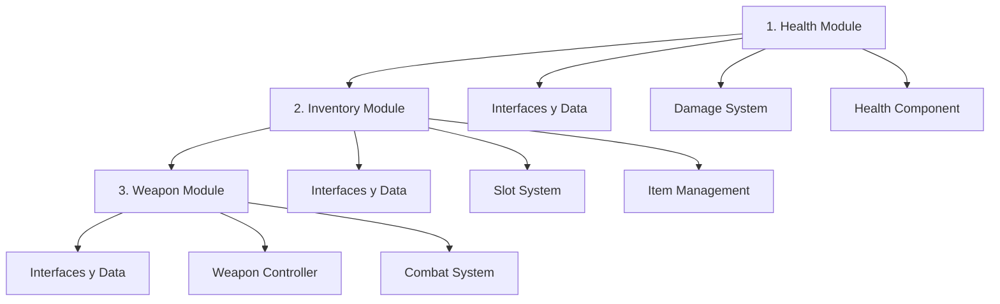
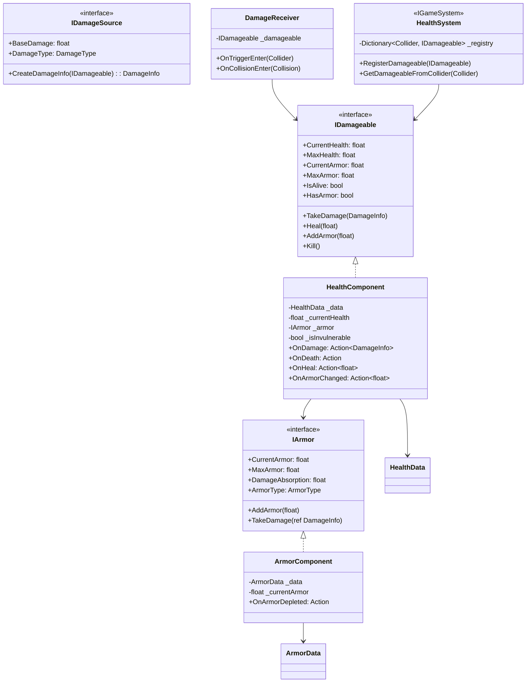
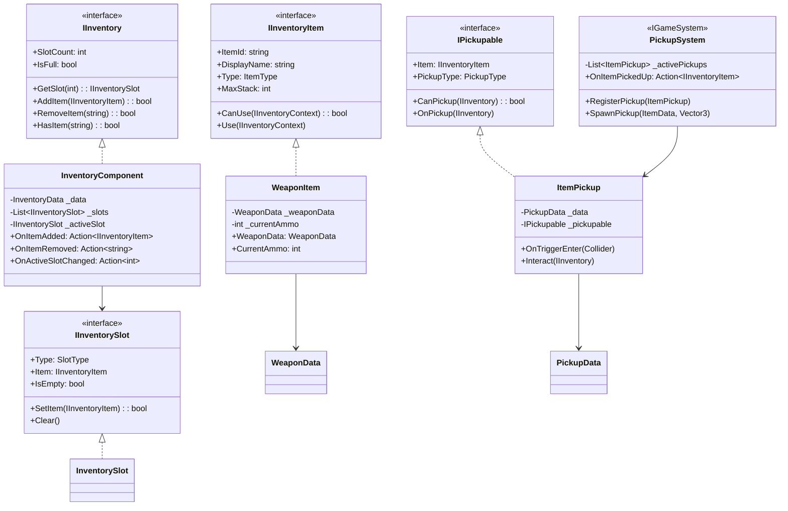
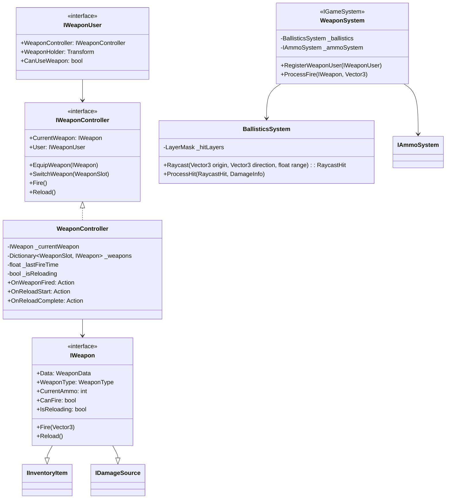
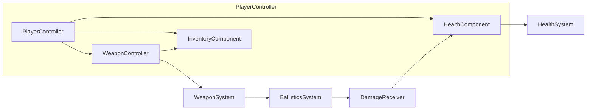
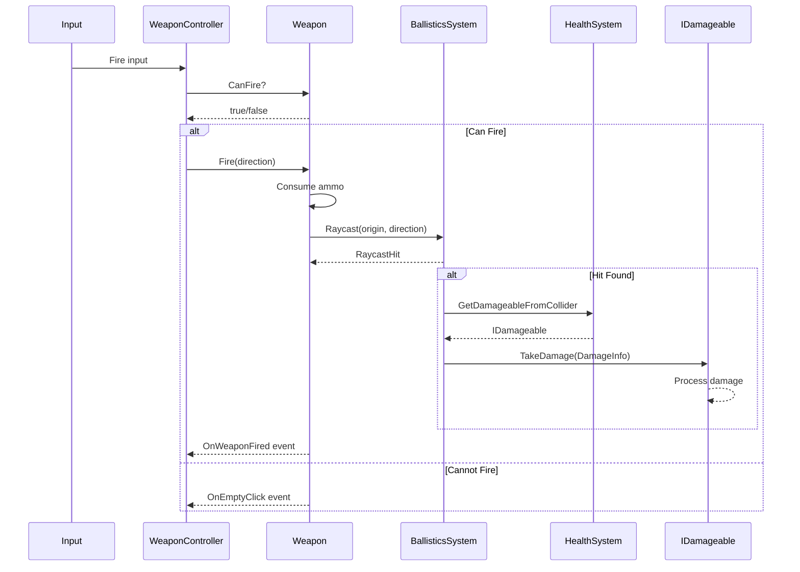
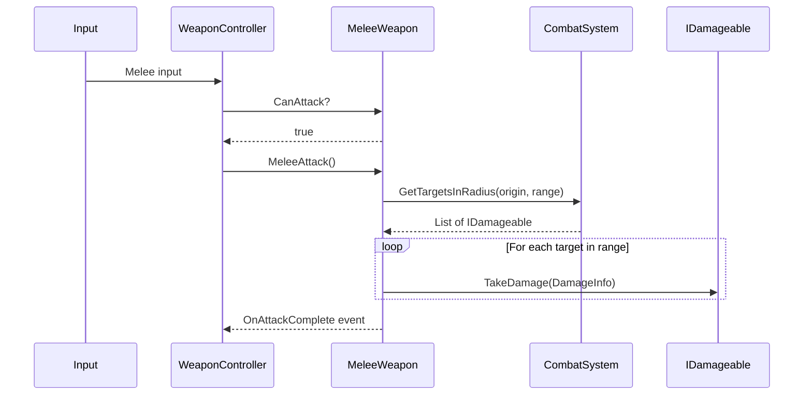
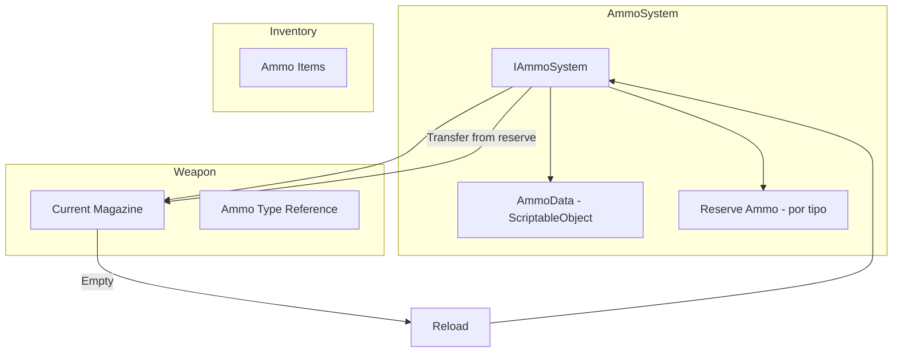
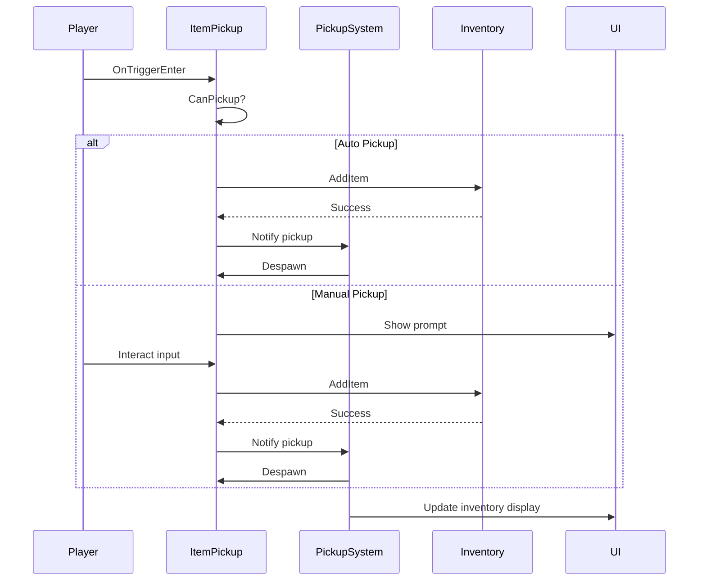

# Arquitectura de Módulos: Salud, Inventario y Armas

## Resumen Ejecutivo

Este documento describe la arquitectura propuesta para implementar el sistema de armas en el framework GTA, incluyendo los módulos dependientes necesarios: **Salud/Daño** e **Inventario**.

---

## Orden de Implementación Recomendado



### ¿Por qué este orden?

1. **Health Module primero**: Las armas causan daño, por lo que necesitamos un sistema de salud funcional antes de implementar armas. Este módulo es independiente.

2. **Inventory Module segundo**: Las armas necesitan ser almacenadas y gestionadas. El inventario simple estilo GTA no depende del sistema de salud.

3. **Weapon Module último**: Depende de ambos módulos anteriores para funcionar correctamente.

---

## Módulo 1: Health - Sistema de Salud y Daño

### Decisiones de Diseño Confirmadas

- ✅ **Armadura/Chaleco**: Parte del Health Module como segunda barra de protección
- ✅ El daño se aplica primero a la armadura antes de afectar la salud

### Estructura de Carpetas Propuesta

```
GTA_Framework/
  Health/
    Interfaces/
      IDamageable.cs          # Interface para entidades que reciben daño
      IDamageSource.cs        # Interface para fuentes de daño
      IHealthSystem.cs        # Interface del sistema de salud
      IArmor.cs               # Interface para sistema de armadura
    Data/
      HealthData.cs           # ScriptableObject con configuración de salud
      ArmorData.cs            # ScriptableObject con configuración de armadura
      DamageInfo.cs           # Struct con información del daño
      DamageType.cs           # Enum: Bullet, Melee, Explosion, Fall, etc.
    Components/
      HealthComponent.cs      # Componente principal de salud
      ArmorComponent.cs       # Componente de armadura/chaleco
      DamageReceiver.cs       # Recibe daño y lo procesa
    Systems/
      HealthSystem.cs         # Sistema centralizado de salud
      DamageCalculator.cs     # Calcula daño con modificadores
    Events/
      HealthEvents.cs         # Eventos de salud: OnDamage, OnDeath, OnHeal
```

### Interfaces Principales

```csharp
// IDamageable.cs - Para cualquier entidad que puede recibir daño
public interface IDamageable
{
    float CurrentHealth { get; }
    float MaxHealth { get; }
    float CurrentArmor { get; }      // Armadura actual
    float MaxArmor { get; }          // Armadura máxima
    bool IsAlive { get; }
    bool IsInvulnerable { get; set; }
    bool HasArmor { get; }           // ¿Tiene armadura equipada?
    
    void TakeDamage(DamageInfo damage);
    void Heal(float amount);
    void AddArmor(float amount);     // Añadir armadura
    void Kill();
}

// IArmor.cs - Sistema de armadura separado para mayor flexibilidad
public interface IArmor
{
    float CurrentArmor { get; }
    float MaxArmor { get; }
    float DamageAbsorption { get; }  // Porcentaje de daño que absorbe (0-1)
    ArmorType ArmorType { get; }     // Light, Medium, Heavy
    
    void AddArmor(float amount);
    void TakeDamage(ref DamageInfo damage);  // Modifica el daño pasado
    bool HasArmor { get; }
}

// IDamageSource.cs - Para cualquier fuente de daño (armas, explosiones, etc.)
public interface IDamageSource
{
    float BaseDamage { get; }
    DamageType DamageType { get; }
    GameObject SourceObject { get; }
    
    DamageInfo CreateDamageInfo(IDamageable target);
}

// IHealthSystem.cs - Sistema centralizado
public interface IHealthSystem : IGameSystem
{
    void RegisterDamageable(IDamageable damageable);
    void UnregisterDamageable(IDamageable damageable);
    IDamageable GetDamageableFromCollider(Collider collider);
}
```

### Data Structures

```csharp
// DamageInfo.cs - Información completa del daño
public struct DamageInfo
{
    public float Amount;
    public DamageType Type;
    public Vector3 HitPoint;
    public Vector3 HitDirection;
    public GameObject Source;
    public GameObject Target;
    public float Force;           // Para knockback
    public float ArmorPenetration; // Porcentaje que ignora armadura (0-1)
}

// DamageType.cs
public enum DamageType
{
    Bullet,
    Melee,
    Explosion,
    Fall,
    Fire,
    Drowning,
    Vehicle,
    General
}

// ArmorType.cs - Tipos de armadura
public enum ArmorType
{
    None,
    Light,      // Chaleco ligero - 50% absorción
    Medium,     // Chaleco estándar - 75% absorción  
    Heavy       // Chaleco pesado - 90% absorción
}

// HealthData.cs - ScriptableObject
[CreateAssetMenu(fileName = "HealthData", menuName = "GTA/Health/HealthData")]
public class HealthData : ScriptableObject
{
    public float maxHealth = 100f;
    public float healthRegenRate = 0f;
    public float regenDelay = 5f;
    public bool canRegen = false;
    public AnimationCurve damageCurve;  // Modificadores por tipo de daño
}

// ArmorData.cs - ScriptableObject para armadura
[CreateAssetMenu(fileName = "ArmorData", menuName = "GTA/Health/ArmorData")]
public class ArmorData : ScriptableObject
{
    public ArmorType armorType = ArmorType.Medium;
    public float maxArmor = 100f;
    public float damageAbsorption = 0.75f;  // 75% del daño va a la armadura
    public float durabilityLossPerDamage = 0.5f;  // La armadura se desgasta
}
```

### Diagrama de Clases - Health Module



---

## Módulo 2: Inventory - Sistema de Inventario

### Decisiones de Diseño Confirmadas

- ✅ **Sistema de Pickups**: Soporte completo para recoger items del mundo
- ✅ Los pickups pueden ser armas, munición, salud, armadura, etc.

### Estructura de Carpetas Propuesta

```
GTA_Framework/
  Inventory/
    Interfaces/
      IInventory.cs            # Interface principal del inventario
      IInventoryItem.cs        # Interface para items
      IInventorySlot.cs        # Interface para slots
      IPickupable.cs           # Interface para objetos recogibles
    Data/
      InventoryData.cs         # Configuración del inventario
      ItemData.cs              # ScriptableObject base para items
      InventorySlot.cs         # Clase para representar un slot
      PickupData.cs            # Datos del pickup
    Enums/
      ItemType.cs              # Weapon, Ammo, Health, Armor, Misc
      SlotType.cs              # Primary, Secondary, Melee, Item
      PickupType.cs            # Ground, Vehicle, NPC
    Components/
      InventoryComponent.cs    # Componente principal
      ItemPickup.cs            # Componente para items en el mundo
      PickupTrigger.cs         # Trigger zone para recoger items
    Systems/
      InventorySystem.cs       # Sistema centralizado
      PickupSystem.cs          # Sistema de pickups
```

### Interfaces Principales

```csharp
// IInventoryItem.cs - Interface para items
public interface IInventoryItem
{
    string ItemId { get; }
    string DisplayName { get; }
    ItemType Type { get; }
    Sprite Icon { get; }
    int MaxStack { get; }
    int CurrentStack { get; set; }
    
    bool CanUse(IInventoryContext context);
    void Use(IInventoryContext context);
}

// IPickupable.cs - Interface para objetos recogibles
public interface IPickupable
{
    IInventoryItem Item { get; }
    PickupType PickupType { get; }
    bool CanPickup(IInventory inventory);
    void OnPickup(IInventory inventory);
    GameObject GameObject { get; }
}

// IInventory.cs - Interface del inventario
public interface IInventory
{
    int SlotCount { get; }
    int UsedSlots { get; }
    bool IsFull { get; }
    
    IInventorySlot GetSlot(int index);
    IInventorySlot GetSlotByType(SlotType type);
    
    bool AddItem(IInventoryItem item);
    bool RemoveItem(string itemId);
    bool RemoveItemFromSlot(int slotIndex);
    
    bool HasItem(string itemId);
    IInventoryItem GetItem(string itemId);
    
    // Eventos
    event Action<IInventoryItem> OnItemAdded;
    event Action<string> OnItemRemoved;
}

// IInventorySlot.cs - Interface para slots
public interface IInventorySlot
{
    SlotType Type { get; }
    IInventoryItem Item { get; }
    bool IsEmpty { get; }
    
    bool SetItem(IInventoryItem item);
    void Clear();
}
```

### Data Structures

```csharp
// ItemType.cs
public enum ItemType
{
    Weapon,
    Ammo,
    Health,
    Armor,
    Key,
    Misc
}

// SlotType.cs - Para inventario estilo GTA
public enum SlotType
{
    Primary,      // Rifles, shotguns
    Secondary,    // Pistols
    Melee,        // Cuchillos, bates
    Throwable,    // Granadas, molotovs
    Item          // Items consumibles
}

// PickupType.cs - Tipo de pickup
public enum PickupType
{
    Ground,       // En el suelo
    Vehicle,      // En un vehículo
    NPC,          // Drop de NPC
    Container     // En un contenedor/caja
}

// InventoryData.cs
[CreateAssetMenu(fileName = "InventoryData", menuName = "GTA/Inventory/InventoryData")]
public class InventoryData : ScriptableObject
{
    public int maxSlots = 8;
    public SlotType[] allowedSlotTypes;
    public int maxItemsPerSlot = 1;  // Para armas: 1 por slot
}

// PickupData.cs - Datos del pickup
[CreateAssetMenu(fileName = "PickupData", menuName = "GTA/Inventory/PickupData")]
public class PickupData : ScriptableObject
{
    public ItemData itemData;
    public int amount = 1;
    public PickupType pickupType = PickupType.Ground;
    public float respawnTime = 30f;      // Tiempo para respawn
    public bool autoPickup = false;       // Recoger automáticamente al tocar
    public float pickupRange = 2f;        // Rango para interactuar
    public GameObject pickupPrefab;       // Prefab visual del pickup
    public AudioClip pickupSound;
}
```

### Diagrama de Clases - Inventory Module



---

## Módulo 3: Weapon - Sistema de Armas

### Estructura de Carpetas Propuesta

```
GTA_Framework/
  Weapon/
    Interfaces/
      IWeapon.cs               # Interface principal del arma
      IWeaponController.cs     # Controlador de armas
      IWeaponUser.cs           # Interface para entidades que usan armas
      IAmmoSystem.cs           # Sistema de munición
    Data/
      WeaponData.cs            # ScriptableObject con datos del arma
      WeaponType.cs            # Enum: Pistol, Rifle, Shotgun, Melee
      WeaponStats.cs           # Stats del arma
    Enums/
      WeaponSlot.cs            # Primary, Secondary, Melee
      FireMode.cs              # Single, Burst, Auto
    Components/
      WeaponController.cs      # Controlador principal
      WeaponVisuals.cs         # Componente visual
      WeaponAudio.cs           # Componente de audio
    Systems/
      WeaponSystem.cs          # Sistema centralizado
      AmmoSystem.cs            # Gestión de munición
      BallisticsSystem.cs      # Raycasts, proyectiles
    Commands/
      FireCommand.cs           # Comando de disparo
      ReloadCommand.cs         # Comando de recarga
      SwitchWeaponCommand.cs   # Comando de cambio de arma
      MeleeAttackCommand.cs    # Comando de ataque melee
```

### Interfaces Principales

```csharp
// IWeapon.cs - Interface del arma
public interface IWeapon : IInventoryItem, IDamageSource
{
    WeaponData Data { get; }
    WeaponType WeaponType { get; }
    FireMode FireMode { get; }
    int CurrentAmmo { get; }
    int MagazineSize { get; }
    bool CanFire { get; }
    bool IsReloading { get; }
    
    void Fire(Vector3 direction);
    void Reload();
    void CancelReload();
}

// IWeaponController.cs - Controlador de armas
public interface IWeaponController
{
    IWeapon CurrentWeapon { get; }
    IWeaponUser User { get; }
    
    void EquipWeapon(IWeapon weapon);
    void UnequipWeapon();
    void SwitchWeapon(WeaponSlot slot);
    
    void Fire();
    void Reload();
    void MeleeAttack();
}

// IWeaponUser.cs - Para entidades que usan armas
public interface IWeaponUser
{
    IWeaponController WeaponController { get; }
    Transform WeaponHolder { get; }
    bool CanUseWeapon { get; }
    
    void OnWeaponEquipped(IWeapon weapon);
    void OnWeaponUnequipped(IWeapon weapon);
}

// IAmmoSystem.cs - Sistema de munición
public interface IAmmoSystem
{
    int GetAmmo(string ammoType);
    void AddAmmo(string ammoType, int amount);
    bool ConsumeAmmo(string ammoType, int amount);
}
```

### Data Structures

```csharp
// WeaponType.cs
public enum WeaponType
{
    Pistol,
    Revolver,
    SMG,
    Rifle,
    Shotgun,
    Sniper,
    Melee,
    Throwable
}

// FireMode.cs
public enum FireMode
{
    Single,
    Burst,
    Automatic
}

// WeaponData.cs
[CreateAssetMenu(fileName = "WeaponData", menuName = "GTA/Weapon/WeaponData")]
public class WeaponData : ItemData
{
    [Header("Weapon Info")]
    public WeaponType weaponType;
    public FireMode fireMode;
    public string ammoType;          // "9mm", "12gauge", etc.
    
    [Header("Stats")]
    public float baseDamage = 25f;
    public float fireRate = 0.5f;    // Segundos entre disparos
    public float range = 100f;
    public float accuracy = 0.95f;
    public int magazineSize = 12;
    public float reloadTime = 2f;
    
    [Header("Physical")]
    public GameObject weaponPrefab;
    public Vector3 equipPosition;
    public Vector3 equipRotation;
    
    [Header("Audio")]
    public AudioClip fireSound;
    public AudioClip reloadSound;
    public AudioClip emptySound;
    
    [Header("Visual")]
    public ParticleSystem muzzleFlash;
    public GameObject impactEffect;
    public TrailRenderer bulletTrail;
}
```

### Diagrama de Clases - Weapon Module



---

## Integración con PlayerController

### Modificaciones Necesarias



### PlayerController Extendido

```csharp
// El PlayerController necesitará implementar interfaces adicionales
public class PlayerController : MonoBehaviour, 
    IDriver,                           // Existente
    IWeaponUser,                       // Nuevo
    IDamageable                        // Nuevo (via HealthComponent)
{
    // Componentes existentes...
    
    // Nuevos componentes
    private HealthComponent _health;
    private InventoryComponent _inventory;
    private WeaponController _weaponController;
    
    // IWeaponUser implementation
    public IWeaponController WeaponController => _weaponController;
    public Transform WeaponHolder => _weaponHolder;
    public bool CanUseWeapon => !IsMovementLocked && IsAlive;
    
    // IDamageable delegation
    public float CurrentHealth => _health.CurrentHealth;
    public bool IsAlive => _health.IsAlive;
    public void TakeDamage(DamageInfo damage) => _health.TakeDamage(damage);
}
```

---

## Flujo de Disparo Completo



---

## Flujo de Ataque Melee



---

## Sistema de Munición

### Diseño



### AmmoSystem

```csharp
public interface IAmmoSystem
{
    // Reserve ammo (inventario)
    int GetReserveAmmo(string ammoType);
    void AddReserveAmmo(string ammoType, int amount);
    bool ConsumeReserveAmmo(string ammoType, int amount);
    
    // Magazine management
    int GetCurrentMagazine(string weaponId);
    void SetCurrentMagazine(string weaponId, int amount);
    
    // Reload
    bool CanReload(IWeapon weapon);
    int Reload(IWeapon weapon);  // Returns amount loaded
}
```

---

## Dependencias y Prioridades de Implementación

### Fase 1: Health Module (Base)

| Prioridad | Componente | Dependencias |
|-----------|-------------|--------------|
| 1.1 | DamageType.cs | Ninguna |
| 1.2 | DamageInfo.cs | DamageType |
| 1.3 | IDamageable.cs | DamageInfo |
| 1.4 | IDamageSource.cs | DamageInfo |
| 1.5 | HealthData.cs | Ninguna |
| 1.6 | HealthComponent.cs | IDamageable, HealthData |
| 1.7 | DamageReceiver.cs | IDamageable |
| 1.8 | HealthSystem.cs | IGameSystem, IDamageable |

### Fase 2: Inventory Module (Sin dependencias de Health)

| Prioridad | Componente | Dependencias |
|-----------|-------------|--------------|
| 2.1 | ItemType.cs | Ninguna |
| 2.2 | SlotType.cs | Ninguna |
| 2.3 | IInventoryItem.cs | ItemType |
| 2.4 | IInventorySlot.cs | IInventoryItem, SlotType |
| 2.5 | IInventory.cs | IInventorySlot |
| 2.6 | ItemData.cs | Ninguna |
| 2.7 | InventoryData.cs | SlotType |
| 2.8 | InventorySlot.cs | IInventorySlot |
| 2.9 | InventoryComponent.cs | IInventory, InventoryData |
| 2.10 | InventorySystem.cs | IGameSystem, IInventory |

### Fase 3: Weapon Module (Depende de Health e Inventory)

| Prioridad | Componente | Dependencias |
|-----------|-------------|--------------|
| 3.1 | WeaponType.cs | Ninguna |
| 3.2 | FireMode.cs | Ninguna |
| 3.3 | WeaponSlot.cs | Ninguna |
| 3.4 | WeaponStats.cs | Ninguna |
| 3.5 | WeaponData.cs | ItemData, WeaponType, FireMode |
| 3.6 | IWeapon.cs | IInventoryItem, IDamageSource, WeaponData |
| 3.7 | IAmmoSystem.cs | Ninguna |
| 3.8 | IWeaponUser.cs | IWeaponController |
| 3.9 | IWeaponController.cs | IWeapon, IWeaponUser |
| 3.10 | AmmoSystem.cs | IAmmoSystem |
| 3.11 | BallisticsSystem.cs | IDamageable, DamageInfo |
| 3.12 | WeaponController.cs | IWeaponController |
| 3.13 | WeaponSystem.cs | IGameSystem, BallisticsSystem |
| 3.14 | WeaponItem.cs | IWeapon, WeaponData |
| 3.15 | Commands | WeaponController |

---

## Integración con Sistemas Existentes

### Con Vehicle System

- El sistema de daño de vehículos ya existe ([`IVehicleDamage`](GTA_Framework/Vehicle/Interfaces/IVehicleDamage.cs))
- Se puede extender para que las armas dañen vehículos
- Los vehículos pueden tener [`DamageReceiver`](GTA_Framework/Health/Components/DamageReceiver.cs) adicional

### Con Animation System

- Añadir estados de animación para:
  - Equipar/Desequipar arma
  - Disparar
  - Recargar
  - Ataque melee
- Usar el sistema de [`IAnimationModule`](GTA_Framework/Animation/Modules/IAnimationModule.cs) existente

### Con Camera System

- Añadir transición a [`AimingCameraState`](GTA_Framework/Camera/States/AimingCameraState.cs) cuando se equipa un arma
- Zoom durante aim

---

## Flujo de Pickup de Items



---

## Preguntas para Refinamiento

### Decisiones Confirmadas

| Pregunta | Decisión |
|----------|----------|
| ¿Armadura/Chaleco parte del Health Module? | ✅ Sí, como segunda barra de protección |
| ¿Sistema de pickups en el mundo? | ✅ Sí, soporte completo |

### Preguntas Pendientes

1. **¿Quieres soporte para armas con proyectiles físicos (cohete, granada) o solo hitscan (raycast)?**

2. **¿Necesitas sistema de attachment para armas (silenciador, mira, etc.)?**

---

## Próximos Pasos

1. Revisar y aprobar esta arquitectura
2. Cambiar a modo Code para implementar el Health Module
3. Implementar Inventory Module
4. Implementar Weapon Module
5. Integrar con PlayerController
6. Crear prefabs y ScriptableObjects de prueba